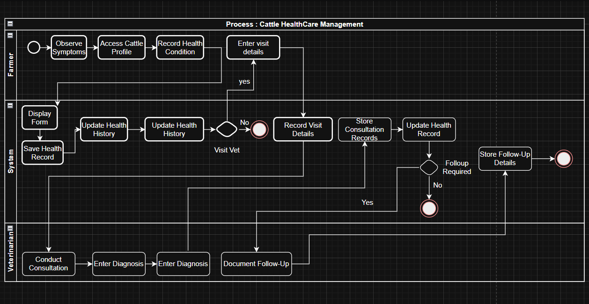

🐄 Cattle Healthcare Management System
📌 Project Overview

The Cattle Healthcare Management System is an end-to-end Business Analysis project designed to digitize cattle health management, streamline medical tracking, and enable data-driven monitoring for livestock operations.

This project covers:

Business Requirement Analysis

Functional & Non-Functional Specifications

UML & Process Modeling

High-Fidelity Figma Prototype

Power BI Analytics Dashboard

🎯 Problem Statement

Traditional livestock health tracking relies heavily on manual record-keeping, leading to:

Missed vaccination schedules

Incomplete treatment records

Poor health monitoring

Lack of centralized medical data

Limited analytical insights

This system proposes a structured digital solution for efficient healthcare tracking and reporting.

👥 Stakeholders

Cattle Farm Owners

Veterinary Doctors

Farm Workers

System Administrator

Stakeholder analysis and mapping were performed to identify system needs and role-based access.

📊 System Design & Visual Artifacts
🧩 Use Case Diagram

Represents actors and their interaction with system functionalities including cattle registration, health updates, vaccination tracking, and reporting.

  

🔄 Swimlane Diagram

Illustrates process flow and responsibility distribution across stakeholders in cattle healthcare management.

  

🖥 Figma Prototype – Dashboard Interface

High-fidelity prototype designed to visualize cattle health metrics and operational summaries.

Features:

Health Status Overview

Vaccination Alerts

Cattle Summary Cards

Role-Based Navigation

  

📝 Figma Prototype – Cattle Health Form

Interface designed for adding and updating cattle medical records.

Features:

Cattle Registration

Disease & Treatment Entry

Vaccination Scheduling

Medical History Logging

  

📈 Power BI Analytics Dashboard

An interactive analytics dashboard built to monitor and analyze cattle health data.

Dashboard Highlights:

Vaccination Compliance Tracking

Disease Distribution Analysis

Treatment History Trends

Health Status Categorization

Farm-Level Performance Metrics

  

📂 Business Analysis Documentation

The project includes structured documentation:

Business Requirement Document (BRD)

Functional Requirement Specification (FRS)

Use Case Diagrams

Swimlane & Process Flow Diagrams

Requirement Traceability Matrix

⚙️ Tools & Technologies Used

Figma (UI/UX Prototype Design)

Power BI (Interactive Dashboard & Analytics)

Draw.io (Process & UML Diagrams)

Business Analysis Frameworks

Requirement Engineering Techniques

🚀 Outcome

The system provides:

Centralized health record management

Improved vaccination compliance

Transparent treatment tracking

Structured process flow

Data-driven operational insights

📫 Contact Me
💼 LinkedIn
✉️ Email: poojachavan.0109@gmail.com

By DataTinker
